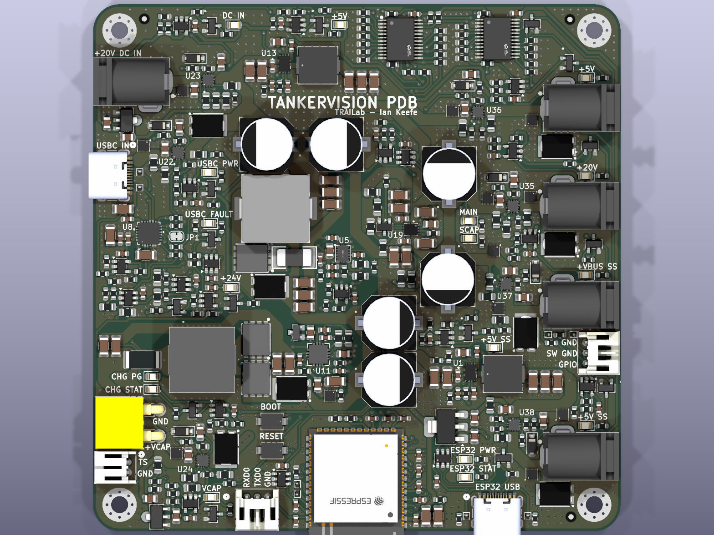
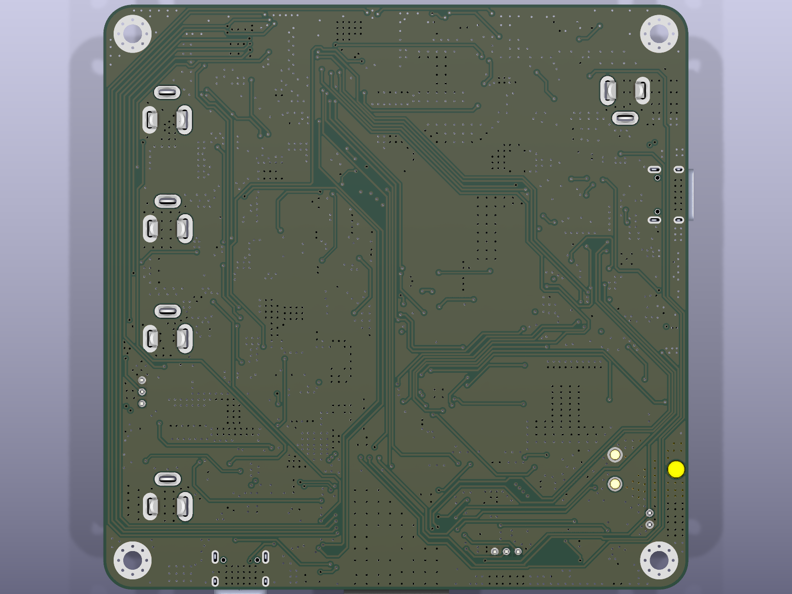

# TankerVision Power Distribution Board

A four-layer KiCad power distribution board (PDB) for the TankerVision robot. It
accepts USB-C PD or an 18.5–20 V DC barrel-jack input, maintains a
supercapacitor-backed rail so an onboard NVIDIA Jetson can shut down cleanly after
input loss, and exposes four independently protected, firmware-controlled output
ports.

Designed in KiCad 9.0.7. Revision 1.0 was fabricated and assembled by JLCPCB in
August 2026.

| | |
|---|---|
|  |  |

## Highlights

- **Dual redundant input** — USB-C PD (CYPD3177 requesting 20 V) and a DC barrel
  jack are ORed through two reverse-blocking LM73100 ideal-diode switches.
- **Supercapacitor backup** — a BQ24640 charges an external bank through a 24.5 V
  LM5155 boost; a TPS2121 priority mux transfers the backed `+VBUS_SS` domain to the
  bank in roughly 5 µs when the input rail collapses.
- **Orderly shutdown** — the backed rails feed the ESP32-S3, which sheds loads,
  pulses the Jetson power button, and watches stored energy on the supercap ADC
  divider to decide when to commit to shutdown.
- **Firmware-independent boot** — input switch → mux IN1 → `+VBUS_SS` → 5 V buck →
  3.3 V LDO brings up the ESP32-S3 with no firmware involvement; every other load
  rail is deliberately under software control.
- **Protected outputs** — four LM73100 output switches provide inrush control,
  reverse blocking, power-good, and current monitoring per port.
- **Full supervision** — fourteen TLV7031 comparators condition status signals and
  two TCA9535 I²C expanders carry enables and status back to the ESP32-S3.

## Board summary

| Item | Value |
|---|---|
| Outline | 100 mm × 100 mm |
| Stackup | 4-layer, 1.6 mm FR-4, 35 µm (1 oz) copper on all layers |
| Planes | In1.Cu solid GND; In2.Cu predominantly GND with selected routing |
| References | 452 in schematic and PCB, matched one-to-one |
| Production BOM | 444 fitted references in 84 orderable groups |
| Input | USB-C PD, or 18.5–20 V DC barrel jack |
| Outputs | 4 protected ports (`+VBUS`, `+5V_VBUS`, `+VBUS_SS`, `+5V_SS`) |
| Controller | ESP32-S3-WROOM-1-N8R8 |

## Documentation

The design is documented per functional block, with schematic labels rather than
drawing coordinates used as the stable way to locate each circuit.

- **[docs/README.md](docs/README.md)** — start here: block index and power-rail table
- **[docs/system-architecture.md](docs/system-architecture.md)** — power flow, control
  and status map, ESP32 pin map, sequencing
- **[docs/pcb-layout.md](docs/pcb-layout.md)** — layout review, stackup, routing,
  fabrication decisions, revision-1.0 order record
- **[docs/issues.md](docs/issues.md)** — open design concerns and pre-deployment
  bench checks
- **[docs/blocks/](docs/blocks/)** — sixteen per-block documents covering USB-PD,
  inrush control, the power mux, the supercap charger and switch, the boost and
  bucks, LDOs, output switches, the ESP32, I/O expanders, comparators, analog
  switches, the Jetson power button, and ADC monitoring

Firmware and board verification:

- **[firmware/deployment/README.md](firmware/deployment/README.md)** — automatic
  startup, supercap maintenance charging, 1 Hz USB telemetry and fixed 60-second
  Jetson shutdown/reboot sequence
- **[firmware/deployment/API.md](firmware/deployment/API.md)** — Jetson USB API,
  with a [Python reference client](firmware/deployment/jetson/README.md)
- **[firmware/deployment/results/upload-2026-09-16/README.md](firmware/deployment/results/upload-2026-09-16/README.md)**
  — verified deployment upload, charging/PG observations and serial reopen results
- **[firmware/board_control_test/README.md](firmware/board_control_test/README.md)**
  — reusable board drivers, bench procedures and historical test results

Generated exports for quick reading without KiCad:

- [docs/exports/tankervision-pdb-schematic.pdf](docs/exports/tankervision-pdb-schematic.pdf)
- [docs/exports/tankervision-pdb-bom.csv](docs/exports/tankervision-pdb-bom.csv)

## Repository layout

```text
hardware/tankervision-pdb/   KiCad project (schematic, PCB, project library tables)
libraries/symbols/           custom symbol libraries (.kicad_sym)
libraries/footprints/        custom footprint libraries (.pretty)
libraries/3dmodels/          custom 3D models referenced by those footprints
docs/                        design documentation, generated exports and renders
firmware/deployment/         ESP32 deployment firmware, Jetson API/client and tests
firmware/board_control_test/  hardware bench firmware, procedures and captured results
manufacturing/rev-1_0/       as-ordered JLCPCB fabrication and assembly package
```

## Opening the project

Requires **KiCad 9.0** or newer.

```sh
git clone https://github.com/ikeefe12/tankervision-pdb.git
cd tankervision-pdb
kicad hardware/tankervision-pdb/tankervision-pdb.kicad_pro
```

The project's `sym-lib-table` and `fp-lib-table` resolve every custom library
through `${KIPRJMOD}/../../libraries/...`, so the libraries load from this
repository with no global KiCad configuration. Standard symbols, footprints, and 3D
models come from the stock KiCad libraries installed with KiCad.

## Design state

Revision 1.0 was ordered from JLCPCB on 2026-08-24. The CAD review finds no
remaining electrical schematic blocker. The firmware records now include successful
converter/port control checks, real-bank charging and backup intervals, and the
first deployment upload with 1 Hz telemetry and same-boot serial reopen on the Mac.
The remaining integration checks in [docs/issues.md](docs/issues.md) include loaded
Jetson shutdown and backup endurance, source hot-plug, thermal validation of the
3.3 V LDO, and output-switch overload cases. The recorded unloaded and MCU-only
checks do not establish those loaded behaviors.

Verification on the current sources with KiCad 9.0.7:

- PCB DRC with schematic parity: 0 violations, 0 unconnected pads, 0 footprint
  errors, 0 parity issues.
- ERC is clean in the KiCad GUI with the project's review exclusions applied.
  Command-line ERC does not apply those exclusions and reports six
  `power_pin_not_driven` items, all of which are the reviewed and accepted cases
  described in the block documentation.

## Credit

Designed by Ian Keefe at TRAILab, University of Toronto Institute for Aerospace
Studies.
