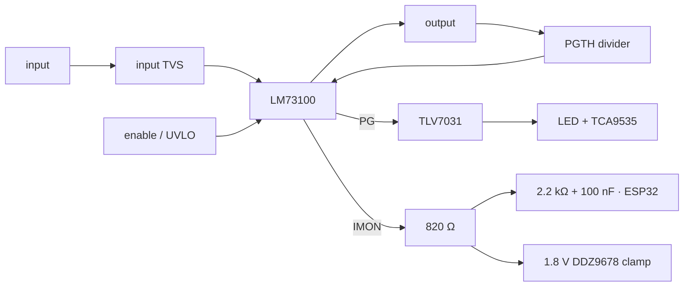

# Common circuit: LM73100 protected power switch (7 instances)

The LM73100 is a 2.7–23 V, 5.5 A protected ideal-diode switch with 28 mΩ typical
back-to-back FETs, reverse-current/reverse-polarity protection, adjustable
OVLO/UVLO/PGTH, controlled dV/dt, IMON, and a fixed fast trip.

Reference constants used here are 1.20 V rising and 1.09 V falling for adjustable
thresholds, 2.34 µA typical dV/dt current, and 181 µA/A typical IMON gain.

## Variants

| Variant | OVLO rising/falling | PG rising/falling | dV/dt | Approximate ramp |
|---|---:|---:|---:|---:|
| USB input | 22.84/20.75 V | 17.07/15.51 V | 4.7 nF | controlled slew |
| DC input | 22.14/20.11 V | 17.07/15.51 V | 4.7 nF | controlled slew |
| supercap | 22.84/20.75 V | 4.48/4.07 V | 4.7 nF | ≈47 ms at 20 V |
| VBUS output | 22.84/20.75 V | 17.07/15.51 V | 4.7 nF | ≈47 ms at 20 V |
| backed VBUS output | 22.84/20.75 V | 9.91/9.00 V | 4.7 nF | ≈47 ms at 20 V |
| 5 V output | 7.04/6.40 V | 4.48/4.07 V | 33 nF + 100 Ω | ≈84 ms at 5.1 V |

U23's 464 kΩ/7.15 kΩ/27 kΩ input ladder additionally gives 17.50 V rising /
15.90 V falling UVLO. This provides startup margin for the specified 18.5–20 V DC
adapter range rather than attempting an exact 18.5 V cutoff.

Every instance uses an 820 Ω IMON load:
`V_IMON = I × 181 µA/A × 820 Ω = 0.148 V/A` typical. Accuracy is ±15% at or above
1 A, ±20% from 0.5–1 A, and unspecified below 0.5 A. The 1.8 V clamp protects the
IMON/ADC node; do not infer precise low-current measurements.

## Instance map

| Ref | Label | Input → output | Enable | IMON / ESP32 | PG destination |
|---|---|---|---|---|---|
| U22 | `USBC INRUSH CTRL` | `+VBUS_USB` → `+VBUS` | U4 `VBUS_USB_EN` | R122 / IO9 | U27 → U26.P00 |
| U23 | `DC INRUSH CTRL` | `+VBUS_DC` → `+VBUS` | resistor UVLO | R124 / IO3 | U28 → U26.P01 |
| U24 | `SUPER CAP SWITCH` | `+VCAP` → `+VCAP_VALID` | ESP32 IO42 | R127 / IO10 | U29 → U26.P02 |
| U35 | `VBUS POWER SWITCH` | `+VBUS` → J7 | U43.P11 | R180 / IO6 | U45 → U43.P00 |
| U36 | `5V VBUS POWER SWITCH` | `+5V_VBUS` → J8 | U43.P10 | R177 / IO5 | U44 → U43.P01 |
| U37 | `SS POWER SWITCH` | `+VBUS_SS` → J9 | U43.P12 | R187 / IO7 | U46 → U43.P02 |
| U38 | `5V SS POWER SWITCH` | `+5V_SS` → J10 | U43.P13 | R181 / IO8 | U47 → U43.P03 |

Input/output TVS parts protect all four external ports. Reverse blocking is what
makes U22/U23 ORing and output-port backfeed protection work. The 100 kΩ PG
pull-ups and 1.5 V U27/U28 thresholds also produce a valid low indication when an
individual input-side switch is unpowered; see
[comparators.md](comparators.md#input-pg-unpowered-state).

The 5.5 A continuous rating is not a programmable 5.5 A current limiter. The fixed
fast trip is approximately 21.9 A and latches the channel off. This behavior is an
accepted design constraint: size/fuse connectors and harnesses for their real load,
and bound any firmware retry of a latched output.

Primary reference: [LM7310/LM73100 datasheet](https://www.ti.com/lit/ds/symlink/lm7310.pdf).
