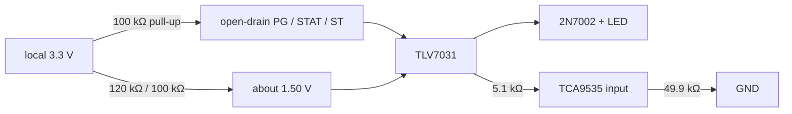
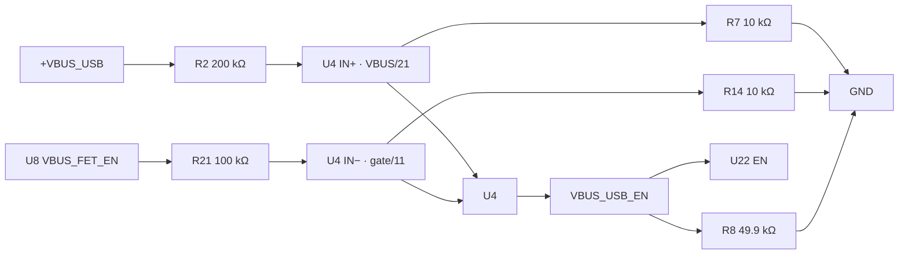

# TLV7031 comparators — logic and reliability audit

**Key parts:** U4/U6/U7/U15/U16/U18/U27–U30/U44–U47 — TLV7031DBVR

## Result

All fourteen instances use the correct DBV pinout: pin 1 OUT, 2 GND, 3 IN+,
4 IN−, and 5 V+. Their normal-state logic is valid. TLV7031 is a good fit for
slow status conditioning: 1.6–6.5 V supply, rail-to-rail/fault-tolerant inputs,
push-pull output, internal hysteresis, and power-on reset that holds OUT low until
the supply is valid.

Every instance has a dedicated 100 nF V+-to-GND bypass capacitor using the common
0603 BOM part (LCSC `C14663`): U4/C19, U6/C28, U7/C29, U15/C72, U16/C73,
U18/C76, U27/C94, U28/C96, U29/C97, U30/C100, U44/C117, U45/C116, U46/C118,
and U47/C119.

U4's `VBUS_USB_EN` polarity and static margins are valid, and R8 gives the signal a
board-level 49.9 kΩ default-low state. The design accepts that this single enable
path is not single-fault tolerant.

Primary references: [TLV7031 datasheet](https://www.ti.com/lit/ds/symlink/tlv7031.pdf)
and [TLV7031-Q1 product](https://www.ti.com/product/TLV7031-Q1).

## Part suitability

| Characteristic | Limit | Board use | Result |
|---|---:|---:|---|
| Supply | 1.6–6.5 V | 3.3 V domains | pass |
| Recommended common mode | GND to V+ + 0.1 V | rail-like status; U4 below 2.3 V | pass |
| Inputs with V+ = 0 | fault tolerant to 7 V | divider/status nodes can outlive supply | pass |
| Offset | ±8 mV max, −40 to 125 °C | U4 static margin ≥ about 188 mV | pass |
| Hysteresis | 2/7/17 mV min/typ/max at 25 °C | ample for status levels | pass |
| Delay | 3 µs typical at 100 mV overdrive; no max | status/control indication | characterize transients |
| Power-up | OUT held low until supply valid; about 200 µs startup | default-low control/status | favorable |
| Temperature | −40 to 125 °C | system ambient TBD | pass if within range |

The catalog DBVR part is not redundant or functionally safe merely because it is
electrically suitable. TLV7031-Q1 improves qualification, not architecture-level
fault tolerance.

## Shared status topology

The 120 kΩ/100 kΩ reference is 1.50 V nominal. A high comparator output reaches
the expander through 5.1 kΩ against 49.9 kΩ, about 0.907 × VOH, with comfortable
logic margin.

## Instance map and polarity

| Ref | Raw input | Output / destination | Meaning when high |
|---|---|---|---|
| U4 | `+VBUS_USB/21` on +; `VBUS_FET_EN/11` on − | `VBUS_USB_EN` → U22 EN | U8 gate signal active/low |
| U6 | U5 PGOOD on + | `24V_VBUS_PG` → U26.P05 | boost good |
| U7 | U1 PG on + | `5V_SS_PG` → U26.P07 | backed buck good |
| U15 | 1.5 V on +; U11 active-low PG on − | `SCC_PG` → U26.P03 | charger input good |
| U16 | 1.5 V on +; U11 active-low STAT on − | `SCC_STAT` → U26.P04 | STAT sinking; blink polarity inverted |
| U18 | U13 PG on + | `5V_VBUS_PG` → U26.P06 | unbacked buck good |
| U27 | U22 PG on + | `PG_USB` → U26.P00 | USB switch good while powered |
| U28 | U23 PG on + | `PG_DC` → U26.P01 | DC switch good while powered |
| U29 | U24 PG on + | `VCAP_PG` → U26.P02 | backup switch output above PGTH |
| U30 | U19 ST on + | `PMUX_ST` → IO11/U25 | IN1 selected or mux output Hi-Z |
| U44 | U36 PG on + | `EXT_5V_VBUS_PG` → U43.P01 | 5 V VBUS port good |
| U45 | U35 PG on + | `EXT_VBUS_PG` → U43.P00 | VBUS port good |
| U46 | U37 PG on + | `EXT_SS_PG` → U43.P02 | SS port good |
| U47 | U38 PG on + | `EXT_5V_SS_PG` → U43.P03 | 5 V SS port good |

`PMUX_ST` high is not uniquely "VBUS present": U19 also reports high when its
output is Hi-Z. Firmware must combine it with input and PG information.

## U4 and `VBUS_USB_EN`

| State | IN+ | IN− | U4 OUT / U22 |
|---|---:|---:|---|
| no valid contract, gate near VBUS | VBUS/21 | VBUS/11 | low / off |
| valid contract, gate near 0 V | VBUS/21 | approximately 0 V | high / enabled |
| U4 supply below POR threshold | — | — | low / off |

At 5 V the nominal no-contract margin is about 216 mV and valid-contract margin is
about 238 mV. Including 1% divider extremes and gate-driver resistance, the smaller
margin remains about 188 mV, well above offset and hysteresis. The highest expected
comparator input remains within its 3.3 V common-mode range.

### Accepted failure behavior

| Fault | Likely outcome |
|---|---|
| U4 unpowered/missing or output open | R8 holds U22 off |
| U4 stuck low; R2 open; R7 short | USB unavailable, fail-off |
| U4 stuck high; R21 open; R14 short | U22 can enable before a valid contract |
| divider short exposing raw VBUS | U4 input overstress risk |

This low-probability single-fault limit is accepted. The board does not claim a
second independent contract/minimum-voltage interlock.

## Input-PG unpowered state

U27/U28 and the R112/R118 PG pull-ups are powered by shared `+3V3_VBUS`, while
U22/U23 operate from the individual USB/DC input domains. The LM73100 specifies a
maximum 0.9 V deasserted PG voltage at 26 µA when its input is below UVP and EN is
in shutdown. At 0.9 V, each 100 kΩ pull-up supplies only
`(3.3 V - 0.9 V) / 100 kΩ = 24 µA`. This is within the specified condition and
remains comfortably below the approximately 1.5 V U27/U28 reference.

An absent input therefore produces low `PG_USB` or `PG_DC` even while the other
source keeps `+3V3_VBUS` alive. A high signal means the corresponding LM73100 has
released PG after its power path is fully on and its PGTH condition is satisfied.
U8 contract state is still the authority for negotiated USB-PD details, but no
additional detector is required to prevent an unpowered-PG false high.

## Bench acceptance tests

- Exercise valid 20 V contracts, incompatible sources, hard/soft reset, detach,
  cable reversal, and brownout. Confirm `VBUS_USB_EN` never glitches high early.
- Verify USB-only with JP1 closed and DC-only with JP1 open; the inputs are not
  intended to be powered simultaneously.
- Verify every conditioned status at the raw pin, comparator output, LED, and
  expander, including U11 STAT blinking and U19 IN1/IN2/Hi-Z states.
