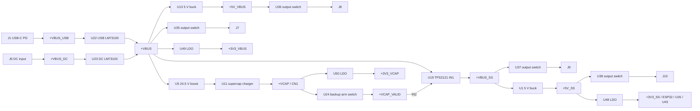

# System Architecture

## Power flow

The firmware-independent boot path is input switch → U19 IN1 → `+VBUS_SS` → U1 →
`+5V_SS` → U48 → `+3V3_SS`. U1 self-enables when its input is high enough. All
other load rails are intentionally under firmware control.

The completed four-layer implementation, routing/plane review, manufacturing
exports, and accepted fabrication decisions are documented in
[pcb-layout.md](pcb-layout.md).

## Input ORing and USB-PD handoff

U22 and U23 are reverse-blocking LM73100 switches whose outputs share `+VBUS`, so
USB and DC form an ideal-diode OR. The permitted DC adapter range is **18.5–20 V**;
the DC path has nominal 17.50 V rising / 15.90 V falling UVLO guard thresholds.
The USB path is enabled by `VBUS_USB_EN`,
which U4 derives from the U8 CYPD3177 `VBUS_FET_EN` gate signal.

JP1 is a default-closed configuration jumper between U8 `VDC_OUT` and shared
`+VBUS`. Leave it closed for USB-C operation and open it before using the DC input.
USB-C and DC are specified as mutually exclusive sources; JP1 is the required
configuration control that prevents DC from driving an unpowered U8.

## Backup and failover

1. Firmware selects the 1.03 A or 1.94 A charge-current network through U12, leaves
   the real thermistor selected through U14 unless a deliberate service/test override
   is needed, enables U5, and then asserts `SCC_EN` through U26.P11. The U11 VFB divider is fixed at 300 kΩ
   over 34 kΩ for a nominal 20.63 V target.
2. Once `VCAP_ADC` shows adequate stored energy, ESP32 IO42 asserts `VCAP_EN`; U24
   connects the bank to `+VCAP_VALID`, U19 IN2.
3. U19 operates in XREF mode. PR1 is VBUS × 5.62/(34+5.62), compared with the
   2.5 V U51 reference. IN1 is preferred above **17.625 V nominal**; below it the
   mux selects IN2. The source-selection interval is about 5 µs typical, while a
   lower-to-higher-voltage transfer can remain in active current limiting for longer.
4. U30 conditions U19 ST into `PMUX_ST`: high means IN1 or output Hi-Z; low means
   IN2. It reaches ESP32 IO11 through R44 and selects source LEDs through U25.
5. During backup, firmware sheds loads, pulses the Jetson button through U43.P14,
   watches `JET_ON_FB`, and uses `VCAP_ADC` for the shutdown-energy decision.

Only `_SS` rails survive input loss. The charger, boost, `+5V_VBUS`, and
`+3V3_VBUS` correctly disappear with `+VBUS`.

## Control and status map

| Signal | Connection | Function |
|---|---|---|
| `24V_VBUS_EN` | U26.P10 → U5 UVLO/SYNC | boost enable |
| `SCC_EN` | U26.P11 → U11 CE | charger enable |
| `SCC_ISET_SW` | U26.P12 → U12 IN | low = 1.03 A; high = 1.94 A |
| `SCC_TS_SW` | U26.P13 → U14 IN | low = real thermistor; high = fixed override |
| `5V_VBUS_EN` | U26.P14 → U13 EN | unbacked 5 V enable |
| `VCAP_EN` | ESP32 IO42 → U24 EN | direct backup-path arm; R38 default-low |
| internal status ×8 | comparators → U26.P00–P07 | USB/DC/VCAP/charger/boost/buck status |
| external enables ×4 | U43.P10/P11/P12/P13 → U36/U35/U37/U38 | output-port enables |
| external status ×4 | U45/U44/U46/U47 → U43.P00/P01/P02/P03 | output-port power good |
| `JET_PWR_BTN_CTRL` | U43.P14 → Q11 | Jetson button actuator |
| `JET_ON_FB` | J5 → U43.P04 | Jetson state input |
| `PMUX_ST` | U30 → R44 → IO11 | mux source status |
| `PD_INT` | U8 → IO39 | PD-controller interrupt |
| `CTRL_IN_INT_N`, `CTRL_EXT_INT_N` | U26/U43 → IO15/IO16 | expander interrupts |

TCA9535 ports power up as inputs, and the external pulldowns make enables low after
a full board power cycle. Neither expander has a reset pin, so an ESP32-only reset
does not necessarily return existing outputs to safe defaults.

## I²C buses

| Bus | ESP32 | Pull-ups | Devices |
|---|---|---|---|
| `PD_SDA`/`PD_SCL` | IO40/IO41 | R27/R28 2.2 kΩ to U3-gated `+3V3_SS` | U8 CYPD3177 HPI at 0x08 |
| `CTRL_SDA`/`CTRL_SCL` | IO17/IO18 | R35/R36 2.2 kΩ to `+3V3_SS` | U26 internal TCA9535 at 0x20; U43 external TCA9535 at 0x21 |

GPIO35–GPIO37 are no-connect, as required for the fitted N8R8 module's octal PSRAM.
GPIO39–GPIO42 are optional pad-JTAG pins, but the board assigns them to PD HPI and
backup-control functions and retains the default USB Serial/JTAG interface.

## ESP32-S3 pin map

| GPIO | Net / role |
|---|---|
| IO0 | boot strap / SW1 |
| IO1 | `SCC_TS_ADC` |
| IO2 | `VCAP_ADC` through U9 isolation switch |
| IO3 | `VIMON_DC` |
| IO4 | `STAT_LED` |
| IO5 | `VIMON_EXT_5V_VBUS` |
| IO6 | `VIMON_EXT_VBUS` |
| IO7 | `VIMON_EXT_SS` |
| IO8 | `VIMON_5V_SS` |
| IO9 | `VIMON_USB` |
| IO10 | `VIMON_SC` |
| IO11 | `PMUX_ST` through R44 |
| IO12 | unused |
| IO15 | `CTRL_IN_INT_N` |
| IO16 | `CTRL_EXT_INT_N` |
| IO17/IO18 | control I²C SDA/SCL |
| IO19/IO20 | native USB D−/D+ through U17 |
| IO21 | unused / no-connect |
| IO35–IO37 | reserved by octal PSRAM; no-connect |
| IO38 | unused / no-connect |
| IO39 | `PD_INT` |
| IO40/IO41 | PD I²C SDA/SCL |
| IO42 | `VCAP_EN` |
| IO47/IO48 | unused / no-connect |
| RXD0/TXD0 | J3 UART |
| EN | R48 pull-up, C60/SW2 to GND |

IO13, IO14, IO21, IO38, IO45–IO48 are unused. The final pinout avoids all
octal-PSRAM pins. IO3 `VIMON_DC` is also the JTAG-source strap, but the default
eFuse configuration ignores it; firmware must not enable strap-selected pad JTAG.

## Monitoring constants

| Measurement | Nominal transfer |
|---|---|
| `VCAP_ADC` | input × 10/(82+10) = input ÷ 9.2 |
| all `VIMON_*` | current × 181 µA/A × 820 Ω = 0.148 V/A typical |
| `SCC_TS_ADC` | 3.3 V × (NTC ∥ 47 kΩ)/(6.2 kΩ + NTC ∥ 47 kΩ) |

## Intended firmware sequence

1. On boot, read both expanders before writing them; immediately force charger,
   boost, backup, and output enables low unless continuity across reset is intentional.
2. Validate the USB-PD contract and available current before enabling large loads.
3. With `SCC_EN` low, select current and thermistor state. Use the real thermistor
   by default. Enable U5, wait for `24V_VBUS_PG`, then enable U11.
4. Monitor `SCC_PG`, `SCC_STAT`, `VCAP_ADC`, and `SCC_TS_ADC`. Arm U24 only after the
   bank has enough energy by asserting direct `VCAP_EN`; then verify `VCAP_PG` and
   mux behavior.
5. Enable required output rails and monitor their PG and IMON signals.
6. On `PMUX_ST` low, shed loads and begin safe shutdown. Keep `VCAP_EN` asserted
   until the deliberate final power-down point; clearing it while IN2 is active
   immediately removes the board's source.

The lack of an expander-reset connection means U26/U43 outputs can persist across an
ESP32-only reset while `+3V3_SS` remains valid. This retained-state behavior is an
accepted architecture choice; firmware must read and reconcile it. If the ESP32
browns out during backup, direct IO42 `VCAP_EN` releases U24 and returns the board to
its default-off state.
